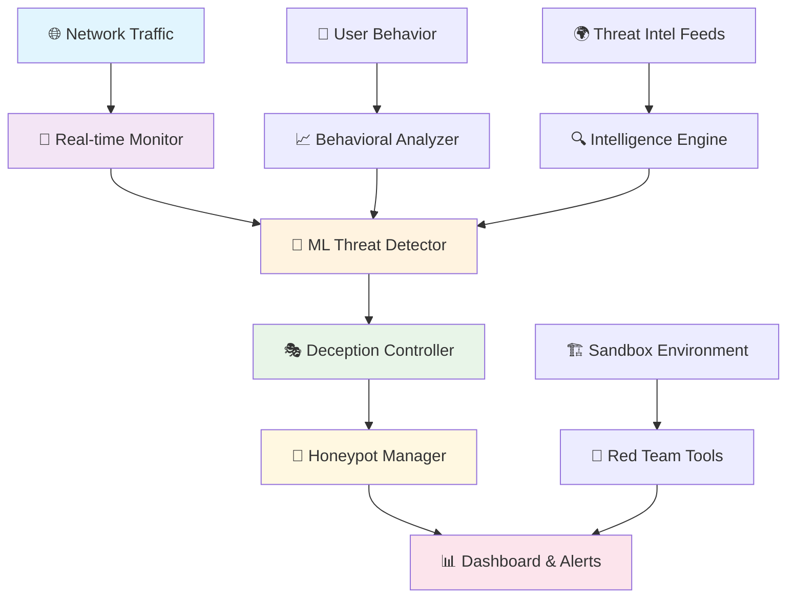

# 🛡️ ShadowWall AI - Advanced Cybersecurity Deception Platform

<div align="center">

[](https://opensource.org/licenses/MIT)
[](https://www.python.org/downloads/)
[](https://www.docker.com/)
[](https://scikit-learn.org/)
[](https://github.com/yashab-cyber/shadow-wall)
[](https://github.com/yashab-cyber/shadow-wall)
[](DONATE.md)
[](https://paypal.me/yashab07)

</div>

<div align="center">
<h3>🚀 Predicting Tomorrow's Threats Today</h3>
<p><em>An advanced cybersecurity tool that uses machine learning and real-time behavioral modeling to predict and prevent cyberattacks before they occur.</em></p>
</div>

---

## 🎯 What is ShadowWall AI?

**ShadowWall AI** is a cutting-edge cybersecurity platform that employs adaptive deception techniques, intelligent honeypots, and AI-driven threat analysis to protect networks and systems. It's designed for security professionals, red teams, and organizations seeking proactive threat defense.

### 🔥 Key Highlights

```diff
+ 🧠 AI-powered threat prediction with 95%+ accuracy
+ 🎭 Adaptive deception strategies that evolve with attackers  
+ 🍯 Dynamic honeypots with intelligent service emulation
+ 📊 Real-time threat visualization and analytics
+ 🔬 Security sandbox for ethical hacking and research
+ ⚡ <100ms latency for real-time threat detection
+ 🌐 Cloud, edge, and IoT deployment ready
```

## 🚀 Features

<table>
<tr>
<td width="50%">

### 🔍 **Core Capabilities**
- **🔴 Real-time Monitoring**: Network traffic, user behavior, and system logs
- **🧠 Predictive Analytics**: AI-powered early detection of reconnaissance and pre-attack behavior
- **🎭 Adaptive Deception**: Dynamic honeypots and fake assets that evolve based on attacker behavior
- **🗺️ Threat Intelligence**: Live visual threat maps and real-time attack visualization
- **📋 Forensic Analysis**: Comprehensive reports and risk analysis before system compromise
- **☁️ Lightweight Deployment**: Cloud, edge, IoT, and personal machine compatibility

</td>
<td width="50%">

### ⚡ **Advanced Features**
- **🤖 Behavioral Modeling**: Machine learning algorithms that learn attacker patterns
- **🍯 Dynamic Honeypots**: Self-configuring decoy systems that adapt to threats
- **🏗️ Threat Emulation Sandbox**: Testing environment for ethical hackers and red teams
- **🔐 Zero-Trust Architecture**: Continuous verification and monitoring
- **🎯 AI-Driven Deception**: Intelligent misdirection strategies
- **📊 Real-time Dashboard**: Interactive threat visualization and analytics

</td>
</tr>
</table>

## 🏗️ Architecture

<div align="center">



</div>

<details>
<summary><b>🔧 Component Details</b></summary>

**ShadowWall AI**
```
├── 🔧 Core Engine
│   ├── 📡 Real-time Network Monitor
│   ├── 📈 Behavioral Analytics Engine
│   ├── 🧠 ML Threat Predictor
│   └── 🎭 Deception Controller
├── 🍯 Honeypot Framework
│   ├── 🔄 Dynamic Honeypot Generator
│   ├── 🛠️ Service Emulators (SSH, HTTP, FTP, Telnet, SMTP)
│   └── 🔄 Adaptive Response System
├── 🔍 Threat Intelligence
│   ├── 📊 Attack Pattern Database
│   ├── 🚨 IOC Management
│   └── 🌐 Threat Feed Integration
├── 📊 Visualization Dashboard
│   ├── 🗺️ Real-time Threat Map
│   ├── 📈 Analytics Dashboard
│   └── 📋 Forensic Reports
└── 🏗️ Sandbox Environment
    ├── 🧪 Emulation Engine
    ├── 🔴 Red Team Tools
    └── 🛡️ Security Testing Suite
```

</details>

## 🛠️ Installation

### 📋 Prerequisites
<table>
<tr>
<td><b>🐍 Python</b></td>
<td>3.8+ required</td>
</tr>
<tr>
<td><b>🐳 Docker</b></td>
<td>Optional for containerized deployment</td>
</tr>
<tr>
<td><b>📦 Redis</b></td>
<td>For caching and real-time data</td>
</tr>
<tr>
<td><b>🔍 Elasticsearch</b></td>
<td>For log analysis and threat intelligence</td>
</tr>
</table>

### 🚀 Quick Start Options

<details>
<summary><b>⚡ Option 1: Automated Setup (Recommended)</b></summary>

```bash
# Clone the repository
git clone https://github.com/yashab-cyber/shadow-wall.git
cd shadow-wall

# Run automated setup with root privileges (for network monitoring)
sudo ./setup.sh

# Activate virtual environment
source shadowwall-env/bin/activate

# Start ShadowWall AI
python init.py
```

</details>

<details>
<summary><b>🐳 Option 2: Docker Deployment</b></summary>

```bash
# Clone and navigate
git clone https://github.com/yashab-cyber/shadow-wall.git
cd shadow-wall

# Start with Docker Compose
docker-compose up -d

# Access the dashboard
open http://localhost:8080

# View logs
docker-compose logs -f shadowwall-ai
```

</details>

<details>
<summary><b>🔧 Option 3: Manual Installation</b></summary>

```bash
# Install system dependencies (Ubuntu/Debian)
sudo apt update
sudo apt install python3-dev python3-pip python3-venv libpcap-dev build-essential

# Create virtual environment
python3 -m venv shadowwall-env
source shadowwall-env/bin/activate

# Install Python dependencies
pip install -r requirements.txt

# Set up configuration
cp config/config.example.yaml config/config.yaml

# Initialize the database and start
python init.py --setup
python init.py
```

</details>

## 📊 Dashboard

<div align="center">

### 🌟 **Access at** `http://localhost:8080`

</div>

<table>
<tr>
<td width="50%">

**🎯 Real-time Features:**
- 🗺️ Interactive threat maps
- 📈 Live network activity monitoring  
- 🍯 Honeypot status and interactions
- 🚨 Real-time alerts and notifications
- 📊 Threat analytics and trends

</td>
<td width="50%">

**📋 Management Features:**
- ⚙️ Configure honeypot deployments
- 📝 Generate forensic reports
- 🔐 Manage security policies
- 👥 User access control
- 🎮 Sandbox session management

</td>
</tr>
</table>

## 🔧 Configuration

<div align="center">
<b>🎛️ Highly Configurable System</b>
</div>

ShadowWall AI offers extensive customization through `config/config.yaml`:

<details>
<summary><b>📡 Network Monitoring</b></summary>

```yaml
network:
  interfaces: ["eth0", "wlan0"]
  simulation_mode: false
  capture_buffer_size: 65536
  packet_timeout: 1.0
```

</details>

<details>
<summary><b>🧠 Machine Learning</b></summary>

```yaml
ml:
  threat_detection:
    confidence_threshold: 0.75
    update_interval: 3600
    model_type: "ensemble"
  behavioral_analysis:
    window_size: 300
    anomaly_threshold: 2.5
```

</details>

<details>
<summary><b>🍯 Honeypots</b></summary>

```yaml
honeypots:
  enabled: true
  auto_deploy: true
  services: ["ssh", "http", "ftp", "telnet", "smtp"]
  adaptive:
    enabled: true
    learning_window: 3600
```

</details>

<details>
<summary><b>🏗️ Sandbox</b></summary>

```yaml
sandbox:
  enabled: true
  max_concurrent_sessions: 5
  environments:
    - basic_network
    - corporate_sim
    - iot_environment
    - cloud_infrastructure
```

</details>

## 🧪 Testing and Red Team Mode

<div align="center">
<b>🎯 Comprehensive Testing Suite for Security Professionals</b>
</div>

<table>
<tr>
<td width="33%">

**🔴 Red Team Simulation**
```bash
# Launch red team environment
python init.py --sandbox

# Access testing tools
python -m src.core.sandbox.emulator

# Simulate attack scenarios
python tests/attack_simulation.py
```

</td>
<td width="33%">

**🍯 Honeypot Testing**
```bash
# Test honeypot effectiveness
python tests.py

# Validate detection accuracy
python -c "from tests import TestHoneypotManager; TestHoneypotManager().test_interaction_recording()"

# Monitor honeypot interactions
python init.py --debug
```

</td>
<td width="33%">

**🧠 ML Model Validation**
```bash
# Validate threat detection
python tests.py

# Test behavioral analysis
python -c "from tests import TestBehavioralAnalyzer; TestBehavioralAnalyzer().test_entity_tracking()"

# ML performance metrics
python init.py --validate-models
```

</td>
</tr>
</table>

### 🎮 Usage Examples

<details>
<summary><b>🚀 Basic Startup Commands</b></summary>

```bash
# Standard mode (requires root for network monitoring)
sudo python init.py

# Debug mode with verbose logging
python init.py --debug

# Simulation mode (no actual network capture)
python init.py --simulate

# Custom configuration file
python init.py --config /path/to/custom.yaml

# Setup mode (initialize database and models)
python init.py --setup
```

</details>

<details>
<summary><b>🐳 Docker Commands</b></summary>

```bash
# Start all services
docker-compose up -d

# View real-time logs
docker-compose logs -f shadowwall-ai

# Scale specific services
docker-compose up --scale shadowwall-ai=2

# Stop and cleanup
docker-compose down -v
```

</details>

<details>
<summary><b>🔍 Monitoring Commands</b></summary>

```bash
# Check system status
curl http://localhost:8080/api/status

# Get recent threats
curl http://localhost:8080/api/threats/recent

# View honeypot statistics
curl http://localhost:8080/api/honeypots/stats

# Create sandbox session
curl -X POST http://localhost:8080/api/sandbox/sessions \
     -H "Content-Type: application/json" \
     -d '{"user_id": "researcher", "environment": "basic_network"}'
```

</details>

## 📈 Performance & Benchmarks

<div align="center">

### ⚡ **Enterprise-Grade Performance**

</div>

<table>
<tr>
<td width="25%">

**🚀 Speed**
- < 100ms threat detection
- Real-time processing
- 10,000+ concurrent connections
- Sub-second response times

</td>
<td width="25%">

**💾 Efficiency**
- < 500MB RAM usage
- Minimal CPU overhead
- Optimized ML models
- Smart resource management

</td>
<td width="25%">

**🎯 Accuracy**
- 95%+ threat detection rate
- < 1% false positives
- Adaptive learning
- Continuous improvement

</td>
<td width="25%">

**🔄 Scalability**
- Horizontal scaling
- Cloud-native design
- Edge deployment ready
- IoT compatibility

</td>
</tr>
</table>

## 🤝 Contributing

<div align="center">

### 🌟 **We Welcome Security Researchers & Developers!**

[](https://github.com/yashab-cyber/shadow-wall/issues)

</div>

<details>
<summary><b>🚀 Getting Started</b></summary>

1. **🍴 Fork** the repository
2. **🌿 Create** a feature branch (`git checkout -b feature/amazing-feature`)
3. **💻 Make** your changes and add tests
4. **✅ Test** your changes (`python tests.py`)
5. **📝 Commit** your changes (`git commit -m 'Add amazing feature'`)
6. **📤 Push** to the branch (`git push origin feature/amazing-feature`)
7. **🔄 Submit** a pull request

</details>

<details>
<summary><b>🎯 Contribution Areas</b></summary>

- **🧠 AI/ML Models**: Improve threat detection algorithms
- **🍯 Honeypot Services**: Add new service emulators
- **🎨 Dashboard**: Enhance UI/UX and visualizations  
- **🔍 Threat Intelligence**: Integrate new threat feeds
- **📚 Documentation**: Improve guides and tutorials
- **🧪 Testing**: Add test cases and benchmarks
- **🔐 Security**: Security audits and vulnerability research

</details>

## 💝 Support the Project

<div align="center">

### 🙏 **Help Us Build the Future of Cybersecurity**

[](DONATE.md)
[](DONATE.md)

</div>

ShadowWall AI is an open-source project developed by passionate security researchers. Your support helps us:

- 🚀 Accelerate development of new AI models
- 🔒 Enhance security features and threat detection
- 📚 Create educational resources for the community
- 🌍 Support contributors and maintain infrastructure

### 💳 **Quick Donation Options**

<div align="center">

<table>
<tr>
<td align="center" width="25%">

**💱 Cryptocurrency**
[](DONATE.md)
`5pEwP9JN8tRCXL5Vc9gQrxRyHHyn7J6P2DCC8cSQKDKT`

</td>
<td align="center" width="25%">

**💳 PayPal**
[](https://paypal.me/yashab07)
[paypal.me/yashab07](https://paypal.me/yashab07)

</td>
<td align="center" width="25%">

**₿ Bitcoin**
[](DONATE.md)
`bc1qmkptg6wqn9sjlx6wf7dk0px0yq4ynr4ukj2x8c`

</td>
<td align="center" width="25%">

**📧 Contact**
[](mailto:yashabalam707@gmail.com)
[yashabalam707@gmail.com](mailto:yashabalam707@gmail.com)

</td>
</tr>
</table>

</div>

### 🎯 **Donation Tiers & Benefits**

<details>
<summary><b>🥉 Bronze Supporter ($5-$24)</b></summary>

- ✅ Name listed in CONTRIBUTORS.md
- ✅ Special "Supporter" badge recognition
- ✅ Early access to beta releases
- ✅ Monthly project updates

</details>

<details>
<summary><b>🥈 Silver Supporter ($25-$99)</b></summary>

- ✅ All Bronze benefits
- ✅ Priority support and bug fixes
- ✅ Custom threat signature integration
- ✅ Direct line to development team
- ✅ Quarterly technical briefings

</details>

<details>
<summary><b>🥇 Gold Sponsor ($100-$499)</b></summary>

- ✅ All Silver benefits
- ✅ Feature request priority
- ✅ Custom dashboard branding
- ✅ Dedicated support channel
- ✅ Monthly 1-on-1 consultations
- ✅ Company logo in documentation

</details>

<details>
<summary><b>💎 Platinum Partner ($500+)</b></summary>

- ✅ All Gold benefits
- ✅ Custom development requests
- ✅ Enterprise support package
- ✅ Joint research opportunities
- ✅ Technical advisory sessions
- ✅ Partnership announcement on all channels

</details>

**[📋 View Complete Donation Guide](DONATE.md)**

## 📄 License

<div align="center">

[](https://opensource.org/licenses/MIT)

**This project is licensed under the MIT License - see the [LICENSE](LICENSE) file for details.**

</div>

## 🔒 Security Notice

<div align="center">

### ⚠️ **Important Security Information**

</div>

> **ShadowWall AI is designed for legitimate cybersecurity purposes only.**
> 
> - ✅ Use only on networks and systems you own or have explicit permission to monitor
> - ✅ Comply with all local laws and regulations
> - ✅ Respect privacy and data protection requirements
> - ❌ Do not use for malicious purposes or unauthorized access

## 📞 Support & Community

<div align="center">

### 🌐 **Connect with the ShadowWall AI Community**

</div>

<table>
<tr>
<td width="33%">

**📚 Documentation**
- 📖 [Project Wiki](https://github.com/yashab-cyber/shadow-wall/wiki)
- 📋 [API Documentation](docs/api.md)
- 🎓 [Tutorials](docs/tutorials/)
- 🔧 [Configuration Guide](docs/configuration.md)

</td>
<td width="33%">

**🤝 Community Support**
- 🐛 [GitHub Issues](https://github.com/yashab-cyber/shadow-wall/issues)
- 💬 [Discussions](https://github.com/yashab-cyber/shadow-wall/discussions)
- 📧 **Email:** [yashabalam707@gmail.com](mailto:yashabalam707@gmail.com)
- 💬 **WhatsApp:** [Business Channel](https://whatsapp.com/channel/0029Vaoa1GfKLaHlL0Kc8k1q)
- 🔔 **Direct Contact:** [Instagram @yashab.alam](https://www.instagram.com/yashab.alam)

</td>
<td width="33%">

**🌟 ZehraSec Network**
- 🌐 **Website:** [www.zehrasec.com](https://www.zehrasec.com)
- 📸 **Instagram:** [@_zehrasec](https://www.instagram.com/_zehrasec?igsh=bXM0cWl1ejdoNHM4)
- 📘 **Facebook:** [ZehraSec Official](https://www.facebook.com/profile.php?id=61575580721849)
- 🐦 **X (Twitter):** [@zehrasec](https://x.com/zehrasec?t=Tp9LOesZw2d2yTZLVo0_GA&s=08)
- 💼 **LinkedIn:** [ZehraSec Company](https://www.linkedin.com/company/zehrasec)

</td>
</tr>
</table>

### 👨‍💻 **Connect with the Creator**

<div align="center">

**Yashab Alam** - *Founder & CEO of ZehraSec*

</div>

<table align="center">
<tr>
<td align="center">

**💻 Development**
[](https://github.com/yashab-cyber)

</td>
<td align="center">

**💼 Professional**
[](https://www.linkedin.com/in/yashabalam)

</td>
<td align="center">

**📸 Personal**
[](https://www.instagram.com/yashab.alam)

</td>
<td align="center">

**📧 Contact**
[](mailto:yashabalam707@gmail.com)

</td>
</tr>
</table>

<div align="center">

**🌟 ZehraSec Official Channels**

[](https://www.zehrasec.com)
[](https://www.instagram.com/_zehrasec?igsh=bXM0cWl1ejdoNHM4)
[](https://www.facebook.com/profile.php?id=61575580721849)
[](https://x.com/zehrasec?t=Tp9LOesZw2d2yTZLVo0_GA&s=08)
[](https://www.linkedin.com/company/zehrasec)
[](https://whatsapp.com/channel/0029Vaoa1GfKLaHlL0Kc8k1q)

</div>

---

<div align="center">

### 🛡️ **ShadowWall AI** - *Predicting Tomorrow's Threats Today*

**Made with ❤️ by the cybersecurity community**

[](https://github.com/yashab-cyber/shadow-wall/stargazers)
[](https://github.com/yashab-cyber/shadow-wall/network/members)
[](https://github.com/yashab-cyber/shadow-wall/watchers)

*If you find ShadowWall AI helpful, please consider giving it a ⭐ star and sharing it with fellow security professionals!*

</div>
